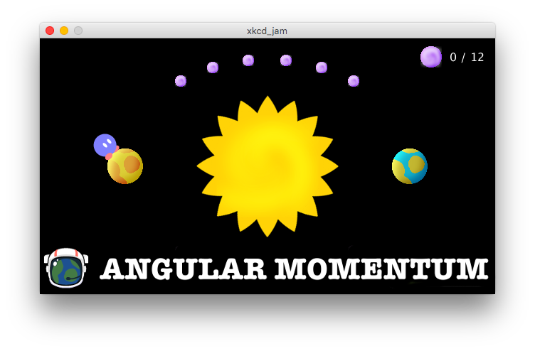

# Angular Momentum

A game loosely based on [xkcd #162](https://xkcd.com/162/), for the [2017 xkcd game jam](https://itch.io/jam/xkcdgamejam).

Download it now on [itch.io](https://gelisam.itch.io/angular-momentum)!

## Art
Helmet image based on https://openclipart.org/detail/176334/space-helmet, everything else I made myself using [GIMP](https://www.gimp.org/).

## Code
Built with [Processing](https://processing.org).

## Music
Made with [Beepbox](http://www.beepbox.co/#5s0kbl01e0et7m0a7g0fj7i0r1w6141f2020d2122c2120h2120v0000o2210b004zhm1g00sh8j4xck5hhg0001010x004i4i4zgP8g0p22WARtvLjoiARznXOA0xKdkafgakOA3VaoQXWRjH3CkQOpdoR-Yd9CVeUeqRcd9rRcu0M8qxMcCeKj8XgR1J7rq5c_Bd38HKxJ3qeKQtt97o6Edx6MzqhS1H3ohG8T4hcqqv2qqB9QVm90kNe8Q4o0zihQ4q2dwq0QAt0q0R4qwQ1G8WgQ1F7hi6wd940).

## Sounds
Made with [BFXR](https://www.bfxr.net/).
